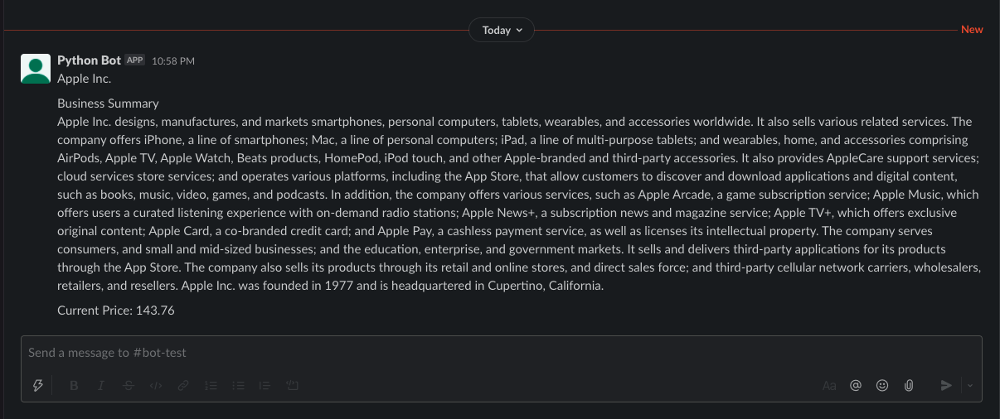

Python Slack Bot 🐍 
===================================

 

Project Objective
--------------------
1. Create a slack bot ✅
2. Connect python and slack bot ✅
3. Allow bot to fetch stock data using yfinance and post on slack ✅
4. Allow slack users to interact with bot (request stock data) 🔨
5. Automate bot to post stock reports at specific time 🔨

 

Install Python Packages
------------------------------
`pip3 install -r requirements.txt`
 

 Slack Config
---------------
1. Create a slack work space for testing
2. https://api.slack.com/apps/ click on `create an App` name your app and select workspace.
3. Click on the Slack Bot card, then click on `Review Scopes to Add` 
4. Select `chat:write` for now
5. Click `Install to workspace`
6. Get Oauth token, copy and paste it into a `.env file` in root folder of project

 <i>Output Figure: current state</i>

 

